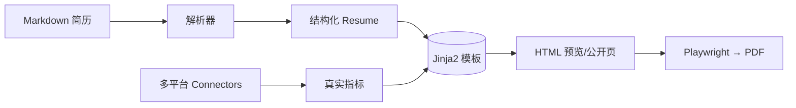

# ResumeCraft · 简历工坊

> Markdown 写简历 → 多模板高保真渲染 → 实时预览 → 一键导出 PDF。结构化数据与排版样式彻底解耦。


## 为什么用 ResumeCraft

传统简历工具把「内容」和「样式」焊死，改模板就得重排内容。ResumeCraft 用一套约定式 Markdown 语法把简历**结构化为数据**，再交给任意模板渲染——内容与排版彻底解耦，写一次内容，随时换风格。

## 核心功能

### 📝 结构化 Markdown，数据与样式解耦
YAML front matter 管样式与元信息，正文只管内容。`##` 级标题驱动分节，`-` 列表生成条目，`[text](url)` 自动识别 GitHub / DeepSeek 等品牌并前置矢量图标。

### 🎨 四套开箱即用模板
minimal（极简卡片）/ gradient（渐变活力）/ mono（硬核黑白）/ dark（暗黑极客）。每套都以 `base.html` 为基类差分覆盖 CSS 变量与主题规则，新增风格只写一个文件。

### 👁 左右分栏 + A4 实时高保真预览
左侧 VS Code 内核 Monaco 编辑器，右侧 A4 画布实时渲染；光标在 Markdown 移动时，预览自动滚动聚焦到对应区块（active-focus 高亮）。

### 📄 高保真 PDF 导出
基于 Playwright（Chromium）渲染，与预览 **100% 一致**，保留背景色、渐变与暗黑底色；支持 HMR 多页 A4 分页。

### 🗄 多文档库
多份 Markdown 简历并存，支持新建 / 复制 / 重命名 / 删除 / 公开切换；`public:true` 的简历自动生成免登录公开页。

### 🔌 多平台数据连接器（证据驱动，杜绝假数字）
- **真实指标**：接入 GitHub / 本地 Git / DeepSeek / 硅基流动 / ServerDefender 等，把排障、提交、Token 用量**客观量化**进简历
- **Git 贡献热力图**：扫描本地 + Gitea 仓库，按 commit hash 跨源去重，生成**真实**的一年间提交热力图（GitHub + Gitea 双源）
- **免 SSH**：经 `postlook` 日志 API 查询（端口 5011），符合内网离线「只用 HTTP」规范
- **诚实原则**：所有数字来自真实数据源；无真实来源的指标一律置空，不硬编码假数

### 🌐 免登录公开简历 / 个人主页
`/p/{slug}` 免登录展示：命中 `data/pages/*.html` 直接托管（炫技个人主页），否则渲染 `public:true` 的干净全屏简历页。

### 🔒 账号登录 + 会话持久化
登录鉴权 + session 双重持久化兜底（服务重启不掉登录态）；定时热更新配置。

## 技术栈

| 层 | 技术 |
|----|------|
| 后端 | Python + FastAPI |
| 解析 | 自研 front matter + 约定式标题分节解析器（支持表格块）|
| 渲染 | Jinja2 模板（base.html 基类 + 4 风格）|
| 编辑器 | VS Code Monaco Editor（CDN 引入，零构建）|
| 数据源 | connectors 多平台真实指标 + 自研 Git 热力图引擎 |
| PDF | Playwright (Chromium) |
| 前端 | 原生 JS + HTML（无构建，零依赖，极简运维）|

## 快速开始

```bash
# 1. 虚拟环境 + 依赖
python3 -m venv venv
./venv/bin/pip install -r backend/requirements.txt

# 2. 安装 Chromium（PDF 导出用，首次一次）
#    国内可加镜像：
PLAYWRIGHT_DOWNLOAD_HOST=https://npmmirror.com/mirrors/playwright/ ./venv/bin/playwright install chromium

# 3. 配置（复制模板）
cp config/config.toml.example config/config.toml
# 可选：数据连接器
cp config/connectors.toml.example config/connectors.toml

# 4. 启动
./run.sh
# 打开 http://localhost:5015
```

## 目录结构

```
ResumeCraft/
├── backend/
│   ├── app/
│   │   ├── main.py            # FastAPI 入口 + 接口
│   │   ├── models.py          # 结构化数据模型
│   │   ├── parser/            # md 解析 + PDF 提取
│   │   ├── render/            # 数据 → HTML（含 git_chart 热力图引擎）
│   │   ├── connectors/        # 多平台真实指标连接器
│   │   └── exporter/          # HTML → PDF
│   ├── templates/             # Jinja2 简历模板（base + 4 风格）
│   └── static/                # 前端（index/app.js + 公开页模板）
├── config/
│   ├── config.toml.example    # 服务配置模板
│   └── connectors.toml.example# 数据连接器配置模板
├── docs/markdown-format.md    # md 格式规范
├── data/examples/example.md   # 示例简历
├── run.sh                     # 启动脚本
└── .gitignore
```

## API 概览

| 类别 | 路径 |
|------|------|
| 服务 | `GET /`, `GET /api/health` |
| 认证 | `POST /api/auth/login`, `/logout`, `GET /api/auth/status` |
| 简历 | `GET/POST /api/documents`, `/api/preview`, `/api/export`, `/api/parse` |
| 公开页 | `GET /p`, `GET /p/{slug}`, `GET /api/public/data` |
| 数据源 | `GET /api/metrics`, `GET /api/git/chart.svg` |

## Markdown 约定（节选）

```markdown
---
template: minimal
layout: full
public: false      # true 时生成免登录公开页
---

# 你的名字

**求职方向**：...
**所在地**：...

> 一句话定位（首因区）

## 工作经历

### 某公司 · 2023.7 - 至今
**岗位**

- **核心项目**：描述（`**标题**：详情`）
- **成果**：量化指标（来自真实数据源）
```

## 架构



## 安全与隐私

- **凭据不入库**：真实 API Key / 密码 / Token 只存在于本地 `config/*.toml`（已 gitignore），仓库仅提供 `*.toml.example` 占位模板
- **简历数据隔离**：`data/`（简历 / 公开页 / 指标缓存）默认 gitignore，不会随仓库发布
- **诚实数据**：所有量化指标来自真实数据源，无真实来源即置空，不写假数字

## 版本

- **v0.x（开发中）**：数据连接器、Git 热力图、公开页、Monaco 编辑器等
- v0.1.x：核心骨架（md 解析 / 4 模板 / 预览 / PDF 导出）
